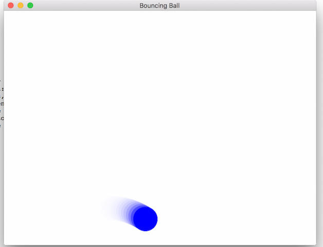
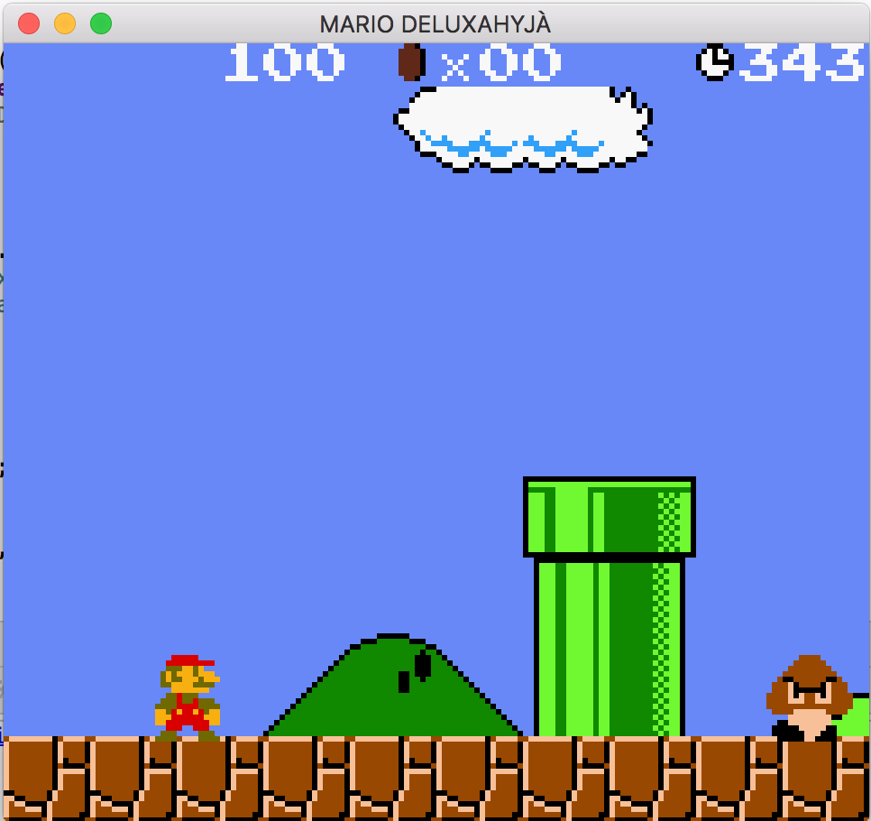

# native-canvas

## Overview
The purpose and intent of this project was to create a library that allows for developers
to create a browser canvas element that runs natively, without the need of a WebBrowser. 
Allowing for developers to code and develop portable canvas based applications that
can run both on the WebBrowser and natively on any NodeJS platform.

## Requirements
* NodeJS 10+

## Getting Stated

* Install the **native-canvas** library

```bash
npm install native-canvas
```

## A Simple Example
```javascript
// Load the library
require('native-canvas');

// Use the globally exposed canvas
const ctx = canvas.getContext("2d");

ctx.lineWidth = 1;
ctx.fillStyle = "#FF0000";
ctx.fillRect(0, 0, 150, 75);
```

View the [samples](./samples) directory to see more examples.


## Running a Browser Example
```javascript
// Load the library
require('native-canvas');

// Title the title attribute
document.title = 'Create Canvas with Document';

// Provides the current running canvas
const canvas = document.createElement('canvas');
const ctx = canvas.getContext("2d");

canvas.height = 150;

ctx.lineWidth = 1;

ctx.clearRect(0, 0, 400, 400);
ctx.beginPath();
ctx.arc(40, 40, 40, 0, 2 * Math.PI);
ctx.closePath();
ctx.stroke();
```

## Mac OS [Apple Silicon]

To install you need to install system deps first.

```bash
brew install python
arch -arm64 brew install pkg-config cairo pango jpeg giflib librsvg libffi
```

## Raspberry Pi

To install on Raspberry Pi, you need to prep your environment
by installing a few dev libraries.

```bash
sudo apt install \
  libpixman-1-dev \
  libcairo2-dev \
  libpango1.0-dev \
  libjpeg-dev \
  libgif-dev \
  libsdl2-dev
```

## Screenshots





## Acknowledgments
Special Thanks to [@dmcquillan314](https://github.com/dmcquillan314) for the support!
